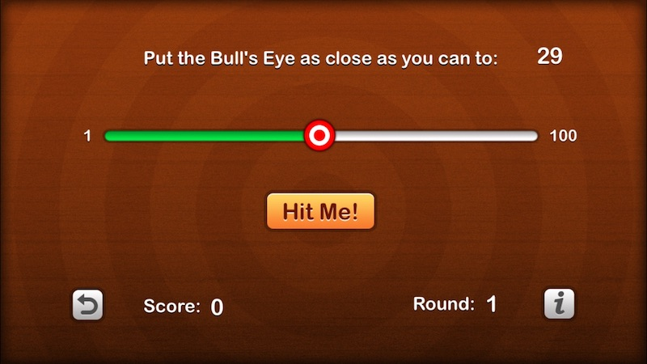

# Bull's Eye 

This is an iOS game where you win points by dragging a slider as close as possible to a target value. The closer you are, the more points you score.  

## Installing

To get the game running, you will need to import the project into Xcode and then run a simulation of the game. You can also
connect your iphone or ipad and run the game on it through Xcode. 

## Screenshots

Game Screen



Score Alert


Info Screen


## Code Examples

The game is played on one screen, which has several labels. One is for target number that appears at the top of the screen, one is for the score
label that changes depending on how many points the player gets, and another is to show the current round. There is also a slider, which is what is used to move the bull's eye. These are all created on the main storyboard as user interface elements, then they are declared as variables in code so that their is a link between the numbers the user sees and their counterpart in code.


```

    var currentValue = 0  
    var targetValue = 0   
    var score = 0         
    var round = 0     
        
    @IBOutlet weak var slider: UISlider!        
    @IBOutlet weak var targetLabel: UILabel!    
    @IBOutlet weak var scoreLabel: UILabel!    
    @IBOutlet weak var roundLabel: UILabel!     


```
When the player presses the Hit Me button, the showAlert function runs. It takes the absolute value of the difference between the target value and the slider's current value. The closer the slider is to this value, the closer the points awarded are to 100. The points are added to the player's score variable, and then a message appears showing
how many points the player scored. The title of the alert will change depending on how close they were to getting the slider to land exactly
on the target value. 

```

      @IBAction func showAlert() {
        let difference = abs(targetValue - currentValue)
        var points = 100 - difference
        
        let title: String
        if difference == 0 {
            title = "Perfect!"
            points += 100
        } else if difference < 5 {
            title = "You almost had it!"
            if difference == 1 {
                points += 50
            }
        } else if difference < 10 {
            title = "Pretty good!"
        } else {
            title = "Not even close..."
        }
        
        score += points
        
        let message = "You scored \(points) points"
    
        let alert = UIAlertController(title: title,
                                      message: message,
                                      preferredStyle: .alert)
        
        let action = UIAlertAction(title: "OK", style: .default,
                                   handler: { action in
                                                self.startNewRound()
                                                self.updateLabels()
                                            })
        
        alert.addAction(action)
        present(alert, animated: true, completion: nil)
    }


```

Every time the player starts a new round, a random number is selected between 1 and 100. The slider is set to 
be in the middle with a current value of 50 to represent this. The labels are updated to show all these new changes. 

```

    func startNewRound() {
        targetValue = 1 + Int(arc4random_uniform(100))
        currentValue = 50
        slider.value = Float(currentValue)
        round += 1
    }
    
    func updateLabels() {
        targetLabel.text = String(targetValue)
        scoreLabel.text = String(score)
        roundLabel.text = String(round)
    }
    
    
    func startNewGame() {
        score = 0
        round = 0
        startNewRound()
    }

```


## Author

* **Justin Uzoije**  - [GitHub Page](https://github.com/justinuzoije)

## License

This project is licensed under the MIT License - see the [LICENSE.md](LICENSE.md) file for details

